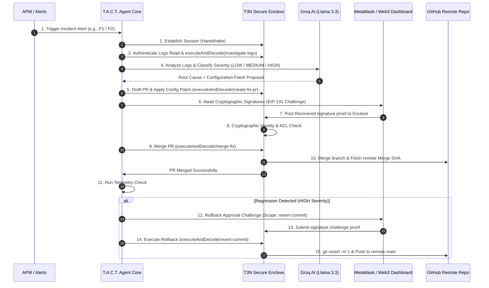

<p align="center">
  <svg width="100%" height="160" viewBox="0 0 800 160" fill="none" xmlns="http://www.w3.org/2000/svg">
    <style>
      @keyframes pulse {
        0% { text-shadow: 0 0 8px #0ea5e9, 0 0 15px #0ea5e9, 0 0 25px #8b5cf6; opacity: 0.85; }
        50% { text-shadow: 0 0 15px #0ea5e9, 0 0 25px #8b5cf6, 0 0 40px #8b5cf6; opacity: 1; }
        100% { text-shadow: 0 0 8px #0ea5e9, 0 0 15px #0ea5e9, 0 0 25px #8b5cf6; opacity: 0.85; }
      }
      @keyframes flow {
        0% { stroke-dashoffset: 0; }
        100% { stroke-dashoffset: -100; }
      }
      .neon-text {
        font-family: 'Outfit', 'Segoe UI', system-ui, -apple-system, sans-serif;
        font-weight: 900;
        font-size: 42px;
        fill: #ffffff;
        animation: pulse 3s infinite ease-in-out;
      }
      .sub-text {
        font-family: 'JetBrains Mono', monospace;
        font-size: 14px;
        fill: #8b5cf6;
        letter-spacing: 0.15em;
      }
      .badge-text {
        font-family: 'JetBrains Mono', monospace;
        font-size: 10px;
        fill: #0ea5e9;
        font-weight: bold;
      }
      .border-glow {
        stroke: url(#cyan-purple-grad);
        stroke-width: 2;
        stroke-dasharray: 20 10;
        animation: flow 4s linear infinite;
      }
    </style>
    <defs>
      <linearGradient id="cyan-purple-grad" x1="0%" y1="0%" x2="100%" y2="100%">
        <stop offset="0%" stop-color="#0ea5e9" />
        <stop offset="50%" stop-color="#8b5cf6" />
        <stop offset="100%" stop-color="#0ea5e9" />
      </linearGradient>
      <filter id="glow" x="-20%" y="-20%" width="140%" height="140%">
        <feGaussianBlur stdDeviation="6" result="blur" />
        <feMerge>
          <feMergeNode in="blur" />
          <feMergeNode in="SourceGraphic" />
        </feMerge>
      </filter>
    </defs>
    <!-- Background border -->
    <rect x="5" y="5" width="790" height="150" rx="12" fill="#0c0e17" stroke="url(#cyan-purple-grad)" stroke-width="1.5"/>
    <rect x="10" y="10" width="780" height="140" rx="8" fill="#090a0f" opacity="0.95"/>
    <!-- Glowing neon lines inside border -->
    <rect class="border-glow" x="12" y="12" width="776" height="136" rx="6" fill="none" opacity="0.7" />
    
    <!-- Glowing Title -->
    <text x="50%" y="70" text-anchor="middle" class="neon-text" filter="url(#glow)">T. A. C. T.</text>
    
    <!-- Subtitle -->
    <text x="50%" y="105" text-anchor="middle" class="sub-text">TEE-SECURED AGENTIC COMMANDER FOR TRIAGE</text>
    
    <!-- Network Status indicator badge -->
    <g transform="translate(35, 30)">
      <circle cx="0" cy="0" r="4" fill="#10B981" filter="url(#glow)">
        <animate attributeName="opacity" values="0.4;1;0.4" dur="2s" repeatCount="indefinite" />
      </circle>
      <text x="12" y="3" class="badge-text" fill="#10B981">T3N TESTNET ACTIVE</text>
    </g>
    <g transform="translate(630, 30)">
      <text x="0" y="3" class="badge-text" fill="#0ea5e9">SECURE ENCLAVE ACTIVE</text>
    </g>
  </svg>
</p>

<p align="center">
  <svg width="100%" height="20" viewBox="0 0 800 20" fill="none" xmlns="http://www.w3.org/2000/svg">
    <path d="M10 10 H790" stroke="url(#cyan-purple-grad-div)" stroke-linecap="round" stroke-width="1.5" />
    <circle cx="400" cy="10" r="4" fill="#8b5cf6" />
    <circle cx="400" cy="10" r="1.5" fill="#0ea5e9" />
    <defs>
      <linearGradient id="cyan-purple-grad-div" x1="0%" y1="0%" x2="100%" y2="0%">
        <stop offset="0%" stop-color="#0ea5e9" stop-opacity="0" />
        <stop offset="25%" stop-color="#0ea5e9" />
        <stop offset="50%" stop-color="#8b5cf6" />
        <stop offset="75%" stop-color="#0ea5e9" />
        <stop offset="100%" stop-color="#0ea5e9" stop-opacity="0" />
      </linearGradient>
    </defs>
  </svg>
</p>

[](https://docs.terminal3.io)
[](https://opensource.org/licenses/MIT)
[](https://groq.com)
[](https://github.com/webassembly)

**T.A.C.T.** is a fully functional, real-time site reliability incident responder designed for next-generation automated infrastructure operations. 

When a production outage alert fires, T.A.C.T. automatically establishes a secure session handshake, triages incident severity, diagnoses logs using **Llama 3.3 (via Groq)**, drafts a patch file, and routes cryptographic EIP-191 approvals to on-call engineers. Merges and rollback actions are securely executed inside a **TEE hardware enclave simulator** and logged permanently onto an **Immutable Cryptographic Audit Ledger**, keeping sensitive keys and PII completely private.

<p align="center">
  <svg width="100%" height="20" viewBox="0 0 800 20" fill="none" xmlns="http://www.w3.org/2000/svg">
    <path d="M10 10 H790" stroke="url(#cyan-purple-grad-div-1)" stroke-linecap="round" stroke-width="1.5" />
    <circle cx="400" cy="10" r="4" fill="#8b5cf6" />
    <circle cx="400" cy="10" r="1.5" fill="#0ea5e9" />
    <defs>
      <linearGradient id="cyan-purple-grad-div-1" x1="0%" y1="0%" x2="100%" y2="0%">
        <stop offset="0%" stop-color="#0ea5e9" stop-opacity="0" />
        <stop offset="25%" stop-color="#0ea5e9" />
        <stop offset="50%" stop-color="#8b5cf6" />
        <stop offset="75%" stop-color="#0ea5e9" />
        <stop offset="100%" stop-color="#0ea5e9" stop-opacity="0" />
      </linearGradient>
    </defs>
  </svg>
</p>

## 📽️ Interactive Web Control Center
T.A.C.T. comes with a premium glassmorphic control center dashboard where you can trigger incidents, sign transactions cryptographically, and inspect live enclave execution logs:
👉 **[http://localhost:3000](http://localhost:3000)**

<p align="center">
  <svg width="100%" height="20" viewBox="0 0 800 20" fill="none" xmlns="http://www.w3.org/2000/svg">
    <path d="M10 10 H790" stroke="url(#cyan-purple-grad-div-2)" stroke-linecap="round" stroke-width="1.5" />
    <circle cx="400" cy="10" r="4" fill="#8b5cf6" />
    <circle cx="400" cy="10" r="1.5" fill="#0ea5e9" />
    <defs>
      <linearGradient id="cyan-purple-grad-div-2" x1="0%" y1="0%" x2="100%" y2="0%">
        <stop offset="0%" stop-color="#0ea5e9" stop-opacity="0" />
        <stop offset="25%" stop-color="#0ea5e9" />
        <stop offset="50%" stop-color="#8b5cf6" />
        <stop offset="75%" stop-color="#0ea5e9" />
        <stop offset="100%" stop-color="#0ea5e9" stop-opacity="0" />
      </linearGradient>
    </defs>
  </svg>
</p>

## 🛠️ System Architecture & Execution Flow

Below is the cryptographic lifecycle of an incident resolution cycle managed by T.A.C.T.:



<p align="center">
  <svg width="100%" height="20" viewBox="0 0 800 20" fill="none" xmlns="http://www.w3.org/2000/svg">
    <path d="M10 10 H790" stroke="url(#cyan-purple-grad-div-3)" stroke-linecap="round" stroke-width="1.5" />
    <circle cx="400" cy="10" r="4" fill="#8b5cf6" />
    <circle cx="400" cy="10" r="1.5" fill="#0ea5e9" />
    <defs>
      <linearGradient id="cyan-purple-grad-div-3" x1="0%" y1="0%" x2="100%" y2="0%">
        <stop offset="0%" stop-color="#0ea5e9" stop-opacity="0" />
        <stop offset="25%" stop-color="#0ea5e9" />
        <stop offset="50%" stop-color="#8b5cf6" />
        <stop offset="75%" stop-color="#0ea5e9" />
        <stop offset="100%" stop-color="#0ea5e9" stop-opacity="0" />
      </linearGradient>
    </defs>
  </svg>
</p>

## 🗝️ Terminal 3 SDK Integration Index

Every secure action in T.A.C.T. translates directly to a Terminal 3 ADK primitive:

### 1. Enclave Handshake
Establishes session keys between the client orchestrator and the TEE hardware sandbox.
* **SDK Wrapper:** [src/sdk-wrapper/t3-agent.ts#L96](file:///c:/Users/Nevan/Desktop/Starlight/src/sdk-wrapper/t3-agent.ts#L96) (`handshake()`)
* **Agent Core:** [src/orchestrator/agent-core.ts#L94](file:///c:/Users/Nevan/Desktop/Starlight/src/orchestrator/agent-core.ts#L94) (`const session = await agent.handshake();`)

### 2. Session Authentication
Authenticates the active session keys.
* **SDK Wrapper:** [src/sdk-wrapper/t3-agent.ts#L110](file:///c:/Users/Nevan/Desktop/Starlight/src/sdk-wrapper/t3-agent.ts#L110) (`authenticate()`)
* **Agent Core:** [src/orchestrator/agent-core.ts#L99](file:///c:/Users/Nevan/Desktop/Starlight/src/orchestrator/agent-core.ts#L99) (`await agent.authenticate({ session })`)

### 3. Guest WASM Contract Publication
Registers the compiled guest WASM component under the tenant's secure z-namespace.
* **SDK Wrapper:** [src/sdk-wrapper/t3-agent.ts#L32](file:///c:/Users/Nevan/Desktop/Starlight/src/sdk-wrapper/t3-agent.ts#L32) (`client.contracts.publish()`)
* **Agent Core:** [src/orchestrator/agent-core.ts#L20](file:///c:/Users/Nevan/Desktop/Starlight/src/orchestrator/agent-core.ts#L20) (`await client.contracts.publish({ script_name, script_version, wasm_binary_path, functions })`)

### 4. Secure Enclave Execution (`executeAndDecode`)
Invokes exported functions (`investigate-logs`, `create-fix-pr`, `merge-fix`, `revert-commit`) inside the isolated WASM guest contract boundary.
* **SDK Wrapper:** [src/sdk-wrapper/t3-agent.ts#L115](file:///c:/Users/Nevan/Desktop/Starlight/src/sdk-wrapper/t3-agent.ts#L115) (`executeAndDecode()`)
* **Agent Core:** [src/orchestrator/agent-core.ts#L105](file:///c:/Users/Nevan/Desktop/Starlight/src/orchestrator/agent-core.ts#L105) (`await agent.executeAndDecode({ script_name, script_version, function_name, input })`)

### 5. Tamper-Proof Audit Ledger (`client.maps`)
Permanently appends immutable transaction steps and audit logs to the T3 `client.maps` store structure under the `z:<tid>:audit-ledger` KV namespace.
* **SDK Wrapper:** [src/sdk-wrapper/t3-agent.ts#L57](file:///c:/Users/Nevan/Desktop/Starlight/src/sdk-wrapper/t3-agent.ts#L57) (`client.maps.set()`)
* **Agent Core:** [src/orchestrator/agent-core.ts#L113](file:///c:/Users/Nevan/Desktop/Starlight/src/orchestrator/agent-core.ts#L113) (`await agent.audit.write({ action, actor, incidentId })`)

<p align="center">
  <svg width="100%" height="20" viewBox="0 0 800 20" fill="none" xmlns="http://www.w3.org/2000/svg">
    <path d="M10 10 H790" stroke="url(#cyan-purple-grad-div-4)" stroke-linecap="round" stroke-width="1.5" />
    <circle cx="400" cy="10" r="4" fill="#8b5cf6" />
    <circle cx="400" cy="10" r="1.5" fill="#0ea5e9" />
    <defs>
      <linearGradient id="cyan-purple-grad-div-4" x1="0%" y1="0%" x2="100%" y2="0%">
        <stop offset="0%" stop-color="#0ea5e9" stop-opacity="0" />
        <stop offset="25%" stop-color="#0ea5e9" />
        <stop offset="50%" stop-color="#8b5cf6" />
        <stop offset="75%" stop-color="#0ea5e9" />
        <stop offset="100%" stop-color="#0ea5e9" stop-opacity="0" />
      </linearGradient>
    </defs>
  </svg>
</p>

## 📂 Source Code Directory

* [wit/world.wit](file:///c:/Users/Nevan/Desktop/Starlight/wit/world.wit) — Defines the WASI contract interface boundaries (`kv-store`, `logging`, `http`, `tenant-context`).
* [src/contract/lib.rs](file:///c:/Users/Nevan/Desktop/Starlight/src/contract/lib.rs) — The Rust TEE Contract. Exposes core APIs (`investigate-logs`, `create-fix-pr`, `merge-fix`, `revert-commit`).
* [src/sdk-wrapper/enclave-sim.ts](file:///c:/Users/Nevan/Desktop/Starlight/src/sdk-wrapper/enclave-sim.ts) — Simulated Intel TDX enclave running ledger memory, EIP-191 signatures, and z-namespace secret maps.
* [src/orchestrator/agent-core.ts](file:///c:/Users/Nevan/Desktop/Starlight/src/orchestrator/agent-core.ts) — SRE event orchestrator driving alerts, AI diagnostics, delegation, and rollback loops.
* [src/orchestrator/github.ts](file:///c:/Users/Nevan/Desktop/Starlight/src/orchestrator/github.ts) — Real Git / GitHub API integrations (commits, pushes, pull requests, merges, and hard resets).
* [server.js](file:///c:/Users/Nevan/Desktop/Starlight/server.js) — Express REST controller serving APIs for webhook alert dispatching, ledger audits, and approval signatures.
* [public/](file:///c:/Users/Nevan/Desktop/Starlight/public/) — Glassmorphic dashboard control center.

<p align="center">
  <svg width="100%" height="20" viewBox="0 0 800 20" fill="none" xmlns="http://www.w3.org/2000/svg">
    <path d="M10 10 H790" stroke="url(#cyan-purple-grad-div-5)" stroke-linecap="round" stroke-width="1.5" />
    <circle cx="400" cy="10" r="4" fill="#8b5cf6" />
    <circle cx="400" cy="10" r="1.5" fill="#0ea5e9" />
    <defs>
      <linearGradient id="cyan-purple-grad-div-5" x1="0%" y1="0%" x2="100%" y2="0%">
        <stop offset="0%" stop-color="#0ea5e9" stop-opacity="0" />
        <stop offset="25%" stop-color="#0ea5e9" />
        <stop offset="50%" stop-color="#8b5cf6" />
        <stop offset="75%" stop-color="#0ea5e9" />
        <stop offset="100%" stop-color="#0ea5e9" stop-opacity="0" />
      </linearGradient>
    </defs>
  </svg>
</p>

## 🚀 Installation & Quick Start

### Prerequisites
* **Node.js** >= 18
* **Rust** + Cargo with the compilation target `wasm32-wasip2`
* **Git** installed and configured in command prompt PATH.

### 1. Installation & Environment Configuration
Clone the repository, enter the workspace, and install dependencies:
```bash
npm install
```

Configure your `.env` file at the root. A pre-populated example is provided below:
```ini
T3N_API_KEY=0x616355559f3b9880cf878749d4d8b42f5b7c9147552ce03793de353f9d3ef00d
T3N_TENANT_DID=did:t3:tenant:c8eb415587d29e3155bb615149156b0ce5f2ecc5
GROQ_API_KEY=your_groq_api_key
GITHUB_REPO=nevan-sonic/T-A-C-T---TEE-Secured-Agentic-Commander-for-Triage
GITHUB_TOKEN=your_github_personal_access_token
SLACK_WEBHOOK_URL=your_slack_webhook_url
```

### 2. Build & Compile
Compile the TypeScript orchestrator and build the Rust WASM TEE Contract:
```bash
# Compile TypeScript to dist/
npm run compile

# Compile Rust contract WASM component targetting WASI p2
cargo build --target wasm32-wasip2 --release
```

### 3. Launch Dashboard
```bash
npm start
```
Navigate to **[http://localhost:3000](http://localhost:3000)**.

<p align="center">
  <svg width="100%" height="20" viewBox="0 0 800 20" fill="none" xmlns="http://www.w3.org/2000/svg">
    <path d="M10 10 H790" stroke="url(#cyan-purple-grad-div-6)" stroke-linecap="round" stroke-width="1.5" />
    <circle cx="400" cy="10" r="4" fill="#8b5cf6" />
    <circle cx="400" cy="10" r="1.5" fill="#0ea5e9" />
    <defs>
      <linearGradient id="cyan-purple-grad-div-6" x1="0%" y1="0%" x2="100%" y2="0%">
        <stop offset="0%" stop-color="#0ea5e9" stop-opacity="0" />
        <stop offset="25%" stop-color="#0ea5e9" />
        <stop offset="50%" stop-color="#8b5cf6" />
        <stop offset="75%" stop-color="#0ea5e9" />
        <stop offset="100%" stop-color="#0ea5e9" stop-opacity="0" />
      </linearGradient>
    </defs>
  </svg>
</p>

## 📡 Real-World APM Webhook Integration
In a production setting, the webhook endpoint `/api/webhook` is designed to be mapped directly to your live SRE monitoring tools. The server dynamically parses and auto-normalizes incoming payloads from the following formats:

### 1. Prometheus Alertmanager Webhook
Route standard Prometheus firings directly to `/api/webhook`. The system maps labels (e.g. `severity: critical`) and annotations to triaged severity states, extracting error metrics and log context automatically:
```json
{
  "status": "firing",
  "alerts": [
    {
      "status": "firing",
      "labels": {
        "alertname": "DatabaseConnectionPoolExhausted",
        "severity": "critical",
        "service": "auth-service"
      },
      "annotations": {
        "summary": "Core database connection timeout",
        "description": "Out of memory crash, thread pool deadlock"
      },
      "startsAt": "2026-06-19T21:00:00Z"
    }
  ]
}
```

### 2. Datadog Webhook
Hook standard Datadog monitor notifications. The router extracts the service name from the alert title and translates warning/error status thresholds into equivalent gated enclave approval flows:
```json
{
  "id": "datadog-alert-101",
  "event_type": "query_alert_monitor",
  "alert_title": "Database pool size exhausted on auth-service",
  "body": "FATAL [auth] Out of memory crash, thread pool deadlock",
  "alert_status": "error"
}
```

<p align="center">
  <svg width="100%" height="20" viewBox="0 0 800 20" fill="none" xmlns="http://www.w3.org/2000/svg">
    <path d="M10 10 H790" stroke="url(#cyan-purple-grad-div-7)" stroke-linecap="round" stroke-width="1.5" />
    <circle cx="400" cy="10" r="4" fill="#8b5cf6" />
    <circle cx="400" cy="10" r="1.5" fill="#0ea5e9" />
    <defs>
      <linearGradient id="cyan-purple-grad-div-7" x1="0%" y1="0%" x2="100%" y2="0%">
        <stop offset="0%" stop-color="#0ea5e9" stop-opacity="0" />
        <stop offset="25%" stop-color="#0ea5e9" />
        <stop offset="50%" stop-color="#8b5cf6" />
        <stop offset="75%" stop-color="#0ea5e9" />
        <stop offset="100%" stop-color="#0ea5e9" stop-opacity="0" />
      </linearGradient>
    </defs>
  </svg>
</p>

## 🔍 Validation Walkthrough

### Test Case 1: Medium Outage (P2 Incident)
1. Select **DB Connection Pool (P2)** scenario and click **Trigger APM Alert**.
2. Handshake session completes and logs are triaged as `MEDIUM` severity (1 signature required from Bob).
3. Llama 3.3 analyzes the logs and drafts a patch fix to increase database pool size to 50 in `db_config.json`.
4. A branch is pushed, and PR is created on your remote GitHub repository.
5. In **Section 3: Approval Guard**, co-signature is requested.
6. Click **Confirm & Sign** (Metamask EIP-191 signatures are supported, with automatic fallback to secure developer private key).
7. The TEE validates the signature, performs a secure merge, and appends the immutable transaction record to the ledger.

### Test Case 2: Outage with Auto-Regression Rollback (P1 Incident)
1. Select **Gateway Failure (P1)** scenario and click **Trigger APM Alert**.
2. Triaged as `HIGH` severity. Routing rules require 2 signatures (Alice & Charlie).
3. Click **Confirm & Sign** for Alice and Charlie's cards.
4. The fix is merged remotely on GitHub. T.A.C.T. initiates a 5-second health telemetry monitoring phase.
5. Telemetry registers a post-merge latency regression. The orchestrator triggers an automatic rollback.
6. **Re-authentication:** Revert action triggers a fresh session. Alice is prompted for a rollback co-signature.
7. Click **Confirm & Sign**. The TEE executes `git revert` on the merge commit and pushes the reverted state back to remote `main`.

### Test Case 3: Manual Rollback
1. Review the newly added **Section 5: Active System Incidents** tracking board.
2. Select any resolved or merged incident and click **Manual Rollback**.
3. A fresh `repo:revert` delegation challenge instantly registers on the **Section 3: Approval Guard** panel.
4. Sign the challenge. The TEE reverts the configuration state and pushes it to GitHub, keeping your repo synchronized.
