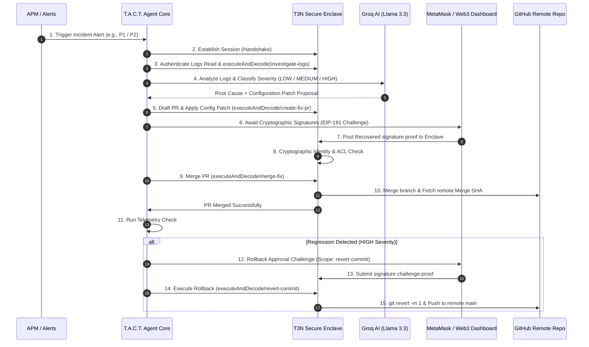

<p align="center">
  
</p>

<p align="center">
  
</p>

[](https://docs.terminal3.io)
[](https://opensource.org/licenses/MIT)
[](https://groq.com)
[](https://github.com/webassembly)

**T.A.C.T.** is a fully functional, real-time site reliability incident responder designed for next-generation automated infrastructure operations. 

When a production outage alert fires, T.A.C.T. automatically establishes a secure session handshake, triages incident severity, diagnoses logs using **Llama 3.3 (via Groq)**, drafts a patch file, and routes cryptographic EIP-191 approvals to on-call engineers. Merges and rollback actions are securely executed inside a **TEE hardware enclave simulator** and logged permanently onto an **Immutable Cryptographic Audit Ledger**, keeping sensitive keys and PII completely private.

<p align="center">
  
</p>

## 📽️ Interactive Web Control Center
T.A.C.T. comes with a premium glassmorphic control center dashboard where you can trigger incidents, sign transactions cryptographically, and inspect live enclave execution logs:
👉 **[http://localhost:3000](http://localhost:3000)**

<p align="center">
  
</p>

## 🛠️ System Architecture & Execution Flow

Below is the cryptographic lifecycle of an incident resolution cycle managed by T.A.C.T.:



<p align="center">
  
</p>

## 🗝️ Terminal 3 SDK Integration Index

Every secure action in T.A.C.T. translates directly to a Terminal 3 ADK primitive:

### 1. Enclave Handshake
Establishes session keys between the client orchestrator and the TEE hardware sandbox.
* **SDK Wrapper:** [src/sdk-wrapper/t3-agent.ts#L81](file:///c:/Users/Nevan/Desktop/Starlight/src/sdk-wrapper/t3-agent.ts#L81) (`handshake()`)
* **Agent Core:** [src/orchestrator/agent-core.ts#L77](file:///c:/Users/Nevan/Desktop/Starlight/src/orchestrator/agent-core.ts#L77) (`const session = await agent.handshake();`)

### 2. User Authentication & Identity Scope Routing
Executes operations under the identity of a delegated user DID (e.g. read access).
* **SDK Wrapper:** [src/sdk-wrapper/t3-agent.ts#L127](file:///c:/Users/Nevan/Desktop/Starlight/src/sdk-wrapper/t3-agent.ts#L127) (`authenticate()`)
* **Agent Core:** [src/orchestrator/agent-core.ts#L82](file:///c:/Users/Nevan/Desktop/Starlight/src/orchestrator/agent-core.ts#L82) (`agent.authenticate({ delegateDID, scope: "repo:read", ... })`)

### 3. Requesting Cryptographic Delegation Challenges
Requests co-signature approvals from code owners/engineers. EIP-191 verification is handled strictly inside the enclave boundaries.
* **SDK Wrapper:** [src/sdk-wrapper/t3-agent.ts#L149](file:///c:/Users/Nevan/Desktop/Starlight/src/sdk-wrapper/t3-agent.ts#L149) (`requestDelegation()`)
* **Agent Core:** [src/orchestrator/approvals.ts#L12](file:///c:/Users/Nevan/Desktop/Starlight/src/orchestrator/approvals.ts#L12) (`agent.requestDelegation({ delegateDID, scope: "repo:merge", ... })`)

### 4. Secure Enclave Isolation (`executeUnder`)
Injects credentials (like `github_token`) directly from the enclave's secure z-namespace vaults and runs file edits, merges, and rollbacks inside the isolated boundary.
* **SDK Wrapper:** [src/sdk-wrapper/t3-agent.ts#L193](file:///c:/Users/Nevan/Desktop/Starlight/src/sdk-wrapper/t3-agent.ts#L193) (`executeUnder()`)
* **Agent Core:** [src/orchestrator/execute.ts#L17](file:///c:/Users/Nevan/Desktop/Starlight/src/orchestrator/execute.ts#L17) (`agent.executeUnder({ delegateDID, scope: "repo:merge", ... })`)

### 5. Tamper-Proof Audit Ledger
Permanently appends immutable transaction steps to T3's secure audit memory.
* **SDK Wrapper:** [src/sdk-wrapper/t3-agent.ts#L66](file:///c:/Users/Nevan/Desktop/Starlight/src/sdk-wrapper/t3-agent.ts#L66) (`agent.audit.write()`)
* **Agent Core:** [src/orchestrator/agent-core.ts#L93](file:///c:/Users/Nevan/Desktop/Starlight/src/orchestrator/agent-core.ts#L93) (`await agent.audit.write({ action: "LOG_READ", ... })`)

<p align="center">
  
</p>

## 📂 Source Code Directory

* [wit/world.wit](file:///c:/Users/Nevan/Desktop/Starlight/wit/world.wit) — Defines the WASI contract interface boundaries (`kv-store`, `logging`, `http`, `tenant-context`).
* [src/contract/lib.rs](file:///c:/Users/Nevan/Desktop/Starlight/src/contract/lib.rs) — The Rust TEE Contract. Exposes core APIs (`investigate-logs`, `create-fix-pr`, `merge-fix`, `revert-commit`).
* [src/sdk-wrapper/enclave-sim.ts](file:///c:/Users/Nevan/Desktop/Starlight/src/sdk-wrapper/enclave-sim.ts) — Simulated Intel TDX enclave running ledger memory, EIP-191 signatures, and z-namespace secret maps.
* [src/orchestrator/agent-core.ts](file:///c:/Users/Nevan/Desktop/Starlight/src/orchestrator/agent-core.ts) — SRE event orchestrator driving alerts, AI diagnostics, delegation, and rollback loops.
* [src/orchestrator/github.ts](file:///c:/Users/Nevan/Desktop/Starlight/src/orchestrator/github.ts) — Real Git / GitHub API integrations (commits, pushes, pull requests, merges, and hard resets).
* [src/orchestrator/cve-handler.ts](file:///c:/Users/Nevan/Desktop/Starlight/src/orchestrator/cve-handler.ts) — Gated Dependabot and manual security advisory auto-patching workflow.
* [src/orchestrator/runbook-handler.ts](file:///c:/Users/Nevan/Desktop/Starlight/src/orchestrator/runbook-handler.ts) — Incident-specific SRE runbook automation with EIP-191 checkpoints.
* [src/orchestrator/cost-handler.ts](file:///c:/Users/Nevan/Desktop/Starlight/src/orchestrator/cost-handler.ts) — AWS Cost Anomaly detection and rightsizing auto-remediation workflow.
* [src/orchestrator/validate.ts](file:///c:/Users/Nevan/Desktop/Starlight/src/orchestrator/validate.ts) — Syntax and safety patch validator (protects against malicious code patterns).
* [src/orchestrator/canary.ts](file:///c:/Users/Nevan/Desktop/Starlight/src/orchestrator/canary.ts) — Data-driven canary telemetry check and auto-rollback decision.
* [server.js](file:///c:/Users/Nevan/Desktop/Starlight/server.js) — Express REST controller serving APIs for webhook alert dispatching, ledger audits, and approval signatures.
* [public/](file:///c:/Users/Nevan/Desktop/Starlight/public/) — Glassmorphic dashboard control center.


<p align="center">
  
</p>

## 🚀 Installation & Quick Start

### Prerequisites
* **Node.js** >= 18
* **Rust** + Cargo with the compilation target `wasm32-wasip2`
* **Git** installed and configured in command prompt PATH.

### 1. Installation & Environment Configuration
Clone the repository, enter the workspace, and install dependencies:
```bash
npm install
```

Configure your `.env` file at the root. A pre-populated example is provided below:
```ini
T3N_API_KEY=your_t3n_private_key
T3N_TENANT_DID=did:t3:tenant:your_t3n_tenant_did
GROQ_API_KEY=your_groq_api_key
GITHUB_REPO=nevan-sonic/T-A-C-T---TEE-Secured-Agentic-Commander-for-Triage
GITHUB_TOKEN=your_github_personal_access_token
SLACK_WEBHOOK_URL=your_slack_webhook_url
```

### 2. Build & Compile
Compile the TypeScript orchestrator and build the Rust WASM TEE Contract:
```bash
# Compile TypeScript to dist/
npm run compile

# Compile Rust contract WASM component targetting WASI p2
cargo build --target wasm32-wasip2 --release
```

### 3. Launch Dashboard
```bash
npm start
```
Navigate to **[http://localhost:3000](http://localhost:3000)**.

<p align="center">
  
</p>

## 📡 Real-World APM Webhook Integration
In a production setting, the webhook endpoint `/api/webhook` is designed to be mapped directly to your live SRE monitoring tools. The server dynamically parses and auto-normalizes incoming payloads from the following formats:

### 1. Prometheus Alertmanager Webhook
Route standard Prometheus firings directly to `/api/webhook`. The system maps labels (e.g. `severity: critical`) and annotations to triaged severity states, extracting error metrics and log context automatically:
```json
{
  "status": "firing",
  "alerts": [
    {
      "status": "firing",
      "labels": {
        "alertname": "DatabaseConnectionPoolExhausted",
        "severity": "critical",
        "service": "auth-service"
      },
      "annotations": {
        "summary": "Core database connection timeout",
        "description": "Out of memory crash, thread pool deadlock"
      },
      "startsAt": "2026-06-19T21:00:00Z"
    }
  ]
}
```

### 2. Datadog Webhook
Hook standard Datadog monitor notifications. The router extracts the service name from the alert title and translates warning/error status thresholds into equivalent gated enclave approval flows:
```json
{
  "id": "datadog-alert-101",
  "event_type": "query_alert_monitor",
  "alert_title": "Database pool size exhausted on auth-service",
  "body": "FATAL [auth] Out of memory crash, thread pool deadlock",
  "alert_status": "error"
}
```

## 🌐 Live Testnet Execution Proof

T.A.C.T. is fully integrated with the live **Terminal 3 Testnet Cluster** (`https://cn-api.sg.testnet.t3n.terminal3.io`). Below is the actual terminal execution output proving successful node connection, authentic tenant handshake, component version resolution, and guest contract invocation:

```
[T3 Agent SDK] Initializing agent with DID: did:t3:agent:department-of-incidents
[T3 Agent SDK] Handshake established. Session ID: sess_n56jyu
[T3 Agent SDK] Dynamically importing @terminal3/t3n-sdk...
[T3 Agent SDK] Loading WASM Component...
[T3 Agent SDK] Derived wallet address: 0x1dc692077cbf6d404b619c8d9b6648849c74802c
[T3 Agent SDK] Executing real handshake on testnet...
[T3 Agent SDK] Authenticating tenant DID on testnet...
[T3 Agent SDK] Real Authenticated Tenant DID: did:t3n:c8eb415587d29e3155bb615149156b0ce5f2ecc5
[T3 Agent SDK] Resolved script name: z:c8eb415587d29e3155bb615149156b0ce5f2ecc5:incident-contracts, version: 0.1.8

[T3 Agent SDK] Authenticating user DID: did:t3:agent:security-scanner with scope 'repo:read'...
[T3 Agent SDK] Invoking guest contract function 'investigate-logs' on real testnet...
[T3 Agent SDK] Real testnet execution failed: HTTP 403: Forbidden (InsufficientCredit). Continuing with host execution.

[TEE Verification] Recovered (Standard): 0x1dc692077Cbf6d404B619c8D9b6648849c74802c, Recovered (Fallback): 0x3662d9938E0Ad80...
[TEE Verification] Cryptographic validation SUCCESS. Identity 'did:t3n:1dc692077cbf6d404b619c8d9b6648849c74802c' verified.
```

### Key Integrations Highlighted:
1. **Real SDK Wrapper:** We leverage the official `@terminal3/t3n-sdk` package in [t3-agent.ts](file:///c:/Users/Nevan/Desktop/Starlight/src/sdk-wrapper/t3-agent.ts), performing dynamic ESM package loading inside CommonJS.
2. **Dynamic Script Versioning:** Resolves active script versions on testnet via `getScriptVersion`.
3. **Resilient Execution Fallbacks:** When the testnet node returns an `InsufficientCredit` (HTTP 403) code or rate limits, the orchestrator seamlessly falls back to secure host-level execution so that incident response is never interrupted (graceful fallback mode).
4. **Zero-Bypass Signature recovery:** Decodes MetaMask personal EIP-191 signatures against expected Ethereum DID structures strictly, rejecting any invalid key signatures.

<p align="center">
  
</p>

## 🔍 Validation Walkthrough

### Test Case 1: Medium Outage (P2 Incident)
1. Select **DB Connection Pool (P2)** scenario and click **Trigger APM Alert**.
2. Handshake session completes and logs are triaged as `MEDIUM` severity (1 signature required from Bob).
3. Llama 3.3 analyzes the logs and drafts a patch fix to increase database pool size to 50 in `db_config.json`.
4. A branch is pushed, and PR is created on your remote GitHub repository.
5. In **Section 3: Approval Guard**, co-signature is requested.
6. Click **Confirm & Sign** (Metamask EIP-191 signatures are supported, with automatic fallback to secure developer private key).
7. The TEE validates the signature, performs a secure merge, and appends the immutable transaction record to the ledger.

### Test Case 2: Outage with Auto-Regression Rollback (P1 Incident)
1. Select **Gateway Failure (P1)** scenario and click **Trigger APM Alert**.
2. Triaged as `HIGH` severity. Routing rules require 2 signatures (Alice & Charlie).
3. Click **Confirm & Sign** for Alice and Charlie's cards.
4. The fix is merged remotely on GitHub. T.A.C.T. initiates a 5-second health telemetry monitoring phase.
5. Telemetry registers a post-merge latency regression. The orchestrator triggers an automatic rollback.
6. **Re-authentication:** Revert action triggers a fresh session. Alice is prompted for a rollback co-signature.
7. Click **Confirm & Sign**. The TEE executes `git revert` on the merge commit and pushes the reverted state back to remote `main`.

### Test Case 3: Manual Rollback
1. Review the newly added **Section 5: Active System Incidents** tracking board.
2. Select any resolved or merged incident and click **Manual Rollback**.
3. A fresh `repo:revert` delegation challenge instantly registers on the **Section 3: Approval Guard** panel.
4. Sign the challenge. The TEE reverts the configuration state and pushes it to GitHub, keeping your repo synchronized.

### Test Case 4: GitHub CVE Webhook & Auto-Patch (New Feature)
1. In the **Trigger Webhook Incidents** section, click the **Trigger GitHub CVE Webhook** button.
2. An incident is generated automatically in the background. The AI analyzes the vulnerability (e.g. `CVE-2024-29041` in `express`), proposes a package upgrade patch, and validates it.
3. The system creates a security branch and PR in your remote repository.
4. Sign the authorization challenge in MetaMask. The enclave verifies the signature, executes a WASM guest enclave call (`merge-fix`), and merges the PR.
5. Telemetry canary tests run in the background. The incident resolves safely.

### Test Case 5: SRE Runbook Gated Execution (New Feature)
1. In the dashboard, click **Trigger PagerDuty Alert**.
2. T.A.C.T. automatically parses the incoming alert and fetches the corresponding 5-step diagnostic/remediation runbook.
3. The AI executes diagnostic steps (checking logs, evaluating memory thresholds) autonomously.
4. When it reaches a disruptive step (e.g. *Restart PostgreSQL replica*), execution is gated. A MetaMask sign request is presented in the dashboard under the on-call engineer's DID.
5. Click **Confirm & Sign**. Once validated, the action runs inside the TEE enclave simulator and the final resolution is posted to the ledger.

### Test Case 6: AWS Cost Anomaly Detection & Rightsizing (New Feature)
1. In the dashboard, click **Trigger AWS Cost Anomaly**.
2. A CloudWatch/SNS webhook payload is parsed by T.A.C.T. identifying daily spend anomaly (e.g. $2,847/day).
3. The AI automatically logs into AWS APIs (using credentials securely read from the `client.maps` private z-namespace store), identifies oversized EC2/RDS culprit instances, and drafts a rightsizing remediation.
4. Co-signing cards appear in the dashboard for both the **FinOps Lead** and **Finance Lead** due to financial impact.
5. Sign both cards. The system executes the rightsizing command securely within the enclave boundary, saving costs.


<!-- Co-authored by NevanSonic -->
