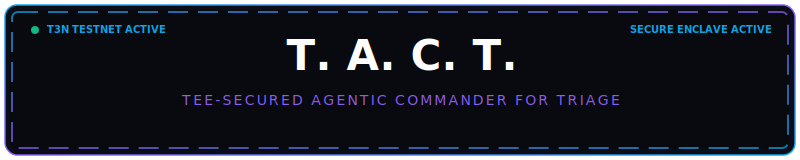
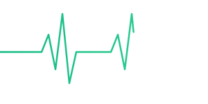
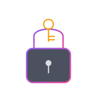
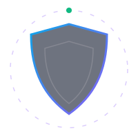

<p align="center">
  
</p>


<div align="center">


<!-- Badges Row 1 -->
<p>
  
  
  
  
</p>

<!-- Badges Row 2 -->
<p>
  
  
  
  
</p>

<br/>

> **When production breaks at 3 AM — T.A.C.T. wakes up, not you.**
> 
> An AI-powered, cryptographically-secured SRE incident responder that triages, diagnoses, patches, collects approvals, merges, monitors, and rolls back — entirely inside a Trusted Execution Environment.

<br/>

</div>

---


## 🎥 Demo

<p align="center">
  <a href="https://youtu.be/BGX3M2ZWhFI">
    
  </a>
</p>

Click the thumbnail above to watch the demo.

---
## Bug Bounty Submission

See [BUG_REPORT.md](./BUG_REPORT.md) for the full list of bugs, broken links, and documentation gaps found in the Terminal 3 SDK, developer docs, and marketing site, submitted as part of the Terminal 3 Bug Discovery Bounty.

---
## ⚡ What Is T.A.C.T.?

**T.A.C.T.** is an autonomous incident response system that eliminates the gap between *alert fires* and *production healed*. When an outage hits, T.A.C.T. automatically:

- 🔍 **Diagnoses** logs with Llama 3.3 via Groq — inside a hardware enclave
- 🩹 **Drafts & validates** a code fix with malicious-pattern detection
- 🔀 **Creates a GitHub PR** from a clean branch with the patch applied
- ✍️ **Collects EIP-191 cryptographic signatures** from engineers via MetaMask
- 🔒 **Merges securely** inside the TEE after approval quorum is met
- 📊 **Monitors health** through a 30-second canary window
- ↩️ **Auto-rolls back** on regression — with a fresh signed credential

Every action is written to an **immutable audit ledger** on the Terminal 3 testnet — a tamper-proof cryptographic trail of who approved what, when, and what changed.

<p align="center">
  
</p>

---

## 🏗️ System Architecture

```
┌─────────────────────────────────────────────────────────────────┐
│                        T.A.C.T. SYSTEM                          │
│                                                                  │
│  ┌──────────────┐    ┌──────────────────┐    ┌───────────────┐  │
│  │   FRONTEND   │    │     BACKEND      │    │  TEE / WASM   │  │
│  │              │    │                  │    │               │  │
│  │  React+Vite  │◄──►│  Express.js      │◄──►│  Rust → WASM  │  │
│  │  (Login)     │    │  (REST API)      │    │  (wasm32-     │  │
│  │              │    │                  │    │   wasip2)     │  │
│  │  Vanilla JS  │    │  Webhook Router  │    │               │  │
│  │  (Dashboard) │    │  Traffic Sim     │    │  Intel TDX    │  │
│  │              │    │                  │    │  Simulator    │  │
│  └──────────────┘    └──────────────────┘    └───────────────┘  │
│         ▲                    ▲                       ▲           │
│         │                   │                       │           │
│    Glassmorphic         Port 3000              KV Secrets       │
│    Control Center       REST API               Never Exposed    │
└─────────────────────────────────────────────────────────────────┘
```

| Layer | Technology | Role |
|:------|:-----------|:-----|
| 🖥️ **Frontend** | React + Vite · Vanilla JS Dashboard | Glassmorphic control center UI |
| ⚙️ **Backend** | Express.js (Node.js) | REST API server, webhook router, traffic simulator |
| 🔐 **TEE / Contract** | Rust → WASM (`wasm32-wasip2`) | Guest contract executed inside hardware enclave simulator |

---

## 🚀 Boot Sequence

When you run `node server.js`, the system initializes in strict order:

```
  ① Auto-Registration
     └─ Missing T3N_CONTRACT_ID? → deploy Rust WASM to Terminal 3 testnet
        └─ Billing failure? → graceful fallback to local simulation

  ② Module Loading
     └─ Loads compiled TypeScript from dist/
        ├─ Enclave Simulator
        ├─ Agent Core
        ├─ Audit Ledger
        ├─ CVE Handler
        ├─ Runbook Handler
        └─ Cost Handler

  ③ Secret Seeding
     └─ Creates private z-namespace KV store in enclave
        ├─ GitHub Token        ─┐
        ├─ Groq API Key         ├─ Never leave TEE boundary
        └─ AWS Credentials     ─┘

  ④ DID Setup
     └─ Derives canonical approver DID from T3N_API_KEY
        └─ Ethereum wallet address required for all approvals

  ⑤ Traffic Simulator
     └─ setInterval every 500ms → reads app_service.js dynamically
        ├─ pool max:20 → 85% errors + high latency
        └─ pool max:50 → healthy fast responses

  ⑥ Express Server
     └─ Port 3000
        ├─ /          → React login app
        └─ /dashboard → Glassmorphic control center
```

---

## 🎯 The 6 Trigger Types

<table>
<tr>
<td width="50%">

### 1️⃣ Manual APM Alert
`POST /api/webhook`

Auto-detects and normalizes payloads from:
- **Prometheus Alertmanager** — parses `alerts[].labels.severity`
- **Datadog** — parses `alert_title`, `alert_status`  
- **T.A.C.T. format** — direct `id/severity/logs`

All normalized → common `Alert` object → `handleIncident()`

</td>
<td width="50%">

### 2️⃣ Auto-Traffic Detection
*Background Monitor*

- `setInterval` checks error rate every **4 seconds**
- Error rate **> 45%** → auto-generates incident
- Runs in **auto-mode**: bypasses PR + approvals
- Directly patches `app_service.js`

</td>
</tr>
<tr>
<td>

### 3️⃣ GitHub CVE Webhook
`POST /api/github-webhook`

Handled by `cve-handler.ts`. Accepts:
- Dependabot alerts
- GitHub Security Advisory webhooks
- Manual CVE test payloads

</td>
<td>

### 4️⃣ PagerDuty / Opsgenie Runbook
`POST /api/pagerduty-webhook`

Handled by `runbook-handler.ts`. Parses incoming alerts into structured step-by-step runbooks with **per-step approval gating**.

</td>
</tr>
<tr>
<td>

### 5️⃣ AWS CloudWatch Cost Anomaly
`POST /api/cloudwatch-webhook`

Handled by `cost-handler.ts`. Accepts:
- SNS / CloudWatch alarms
- AWS Cost Anomaly Detection webhooks
- Manual test payloads

</td>
<td>

### 6️⃣ Manual Rollback
`POST /api/incidents/:id/rollback`

Any resolved/merged incident can be manually rolled back via the dashboard. Triggers a **fresh delegation challenge** — the approver must re-sign.

</td>
</tr>
</table>

---

## 🔄 The Incident Resolution Pipeline

> **9 steps. Zero human bottlenecks (unless severity requires it).**

<p align="center">
  
</p>

```
APM Alert ──► Webhook ──► Normalize Payload ──► handleIncident()
                                                       │
                              ┌────────────────────────┘
                              ▼
                    ┌─────────────────┐
            Step 1  │  TEE Handshake  │  T3nClient auth · DID on-chain
                    └────────┬────────┘
                             ▼
                    ┌─────────────────┐
            Step 2  │ Log Investigation│  Groq → Llama 3.3 inside enclave
                    │   (Inside TEE)  │  Returns: rootCause · patch · explanation
                    └────────┬────────┘
                             ▼
                    ┌─────────────────┐
            Step 3  │ Patch Validation │  Score 0-100
                    │                 │  ✗ eval/child_process/fs.unlink → REJECT
                    │                 │  ✓ Score ≥ 70 → SAFE
                    └────────┬────────┘
                             ▼
                    ┌─────────────────┐
            Step 4  │    Severity     │  LOW   → 0 approvals, auto-resolve
                    │ Classification  │  MEDIUM → 1 signature (code owner)
                    │   (via Groq)   │  HIGH  → 2 signatures + rollback ready
                    └────────┬────────┘
                             ▼
                 ┌───────────┴───────────┐
                 ▼                       ▼
         [Auto-Mode]               [Manual-Mode]
              │                         │
              │                ┌────────▼────────┐
              │        Step 5  │   Create PR      │  New branch · push · Octokit
              │                └────────┬────────┘
              │                         ▼
              │                ┌─────────────────┐
              │        Step 6  │ Approval Guard   │  EIP-191 · MetaMask
              │                │                 │  30-min timeout · poll/1s
              │                └────────┬────────┘
              │                         ▼
              │                ┌─────────────────┐
              │        Step 7  │  Secure Merge   │  executeUnder() in TEE
              │                │   (Inside TEE)  │  EIP-191 re-verification
              │                └────────┬────────┘
              │                         │
              └──────────┬──────────────┘
                         ▼
                ┌─────────────────┐
        Step 8  │  Canary Window  │  6 × 5s polls
                │                 │  < 10%  → ✅ Resolved
                │                 │  10-25% → ⚠️ Degraded (ok)
                │                 │  > 25%  → ❌ Regression!
                └────────┬────────┘
                         │
            ┌────────────┴───────────┐
            ▼                        ▼
       ✅ Healthy                ❌ Regression
    Resolve + Audit                  │
                            ┌────────▼────────┐
                    Step 9  │  Auto-Rollback  │  Fresh TEE session
                            │                 │  Re-sign · git revert
                            │                 │  Push to GitHub
                            └─────────────────┘
```

---

## 🦀 The Rust WASM Contract

The heart of the TEE — four functions that run **inside the enclave**, reading secrets directly from the private KV store:

| Function | Purpose |
|:---------|:--------|
| `investigate-logs` | Reads Groq key from private KV → calls Groq API → returns `{ rootCause, patch, explanation }` |
| `create-fix-pr` | Reads GitHub token → creates branch + commits file + opens PR via GitHub API |
| `merge-fix` | Reads GitHub token → merges the PR via GitHub API |
| `revert-commit` | Reads GitHub token → overwrites file with original content via GitHub API |

> **Critical:** All secrets are read from `z:<tid>:secrets` — they **never exist in host memory**.

---

## 🛡️ Zero-Secrets Security Model

<p align="center">
  
</p>

```
┌─────────────────────────────────────────────────────────────────┐
│                    SECURITY BOUNDARY                            │
│                                                                  │
│  OUTSIDE (TypeScript/Node.js)     │  INSIDE (Rust WASM / TEE)  │
│  ─────────────────────────────    │  ────────────────────────── │
│                                   │                             │
│  ✓ Structured results only  ◄────►│  Groq API Key              │
│  ✗ Never sees raw secrets         │  GitHub Token              │
│  ✗ getSecret() throws if          │  AWS Credentials           │
│    real client is active          │                             │
│                                   │  z:<tid>:secrets (private) │
│                                   │  z:<tid>:audit-ledger (pub) │
└─────────────────────────────────────────────────────────────────┘
```

**How it works:**
1. Secrets seeded into private `z-namespace KV` store at startup
2. Rust contract reads secrets **inside the enclave** for every API call
3. TypeScript orchestrator only receives structured results — never raw credentials
4. On real testnet: `buildSecureContext().getSecret()` **throws** if real client is active
5. Fallback to local simulator only on billing/network errors

---

## 🏛️ Enclave Simulator

Simulates **Intel TDX** hardware with full ACL enforcement:

```
EnclaveSimulator
├── KV Store (ACL-governed maps)
│   ├── z:<tid>:secrets          ← Private · TEE-only access
│   └── z:<tid>:audit-ledger     ← Public · immutable append-only
│
├── Immutable Audit Ledger
│   └── LOG_READ · PATCH_VALIDATED · MERGE_EXECUTED · ROLLBACK_EXECUTED · ...
│
├── Approval System
│   ├── EIP-191 signature verification
│   └── Dual-message format support
│
└── Contract ID Allocation
    └── Map reader/writer ACL enforcement
```

---

## 📡 API Reference

<details>
<summary><b>🔽 Click to expand full API reference</b></summary>

| Method | Endpoint | Purpose |
|:-------|:---------|:--------|
| `POST` | `/api/webhook` | Main APM webhook (Prometheus / Datadog / T.A.C.T.) |
| `POST` | `/api/github-webhook` | CVE / Dependabot / Security Advisory |
| `POST` | `/api/pagerduty-webhook` | PagerDuty / Opsgenie runbook alerts |
| `POST` | `/api/cloudwatch-webhook` | AWS cost anomaly alerts |
| `GET` | `/api/incidents` | List all active incidents |
| `GET` | `/api/incidents/:id/runbook` | Get runbook steps for an incident |
| `POST` | `/api/incidents/:id/rollback` | Manual rollback trigger |
| `GET` | `/api/ledger` | Immutable audit ledger |
| `GET` | `/api/approvals` | Pending approval challenges |
| `POST` | `/api/approve` | Submit EIP-191 signature |
| `GET` | `/api/telemetry-metrics` | Live latency + error rate |
| `GET` | `/api/service` | Mock DB endpoint for traffic testing |
| `POST` | `/api/stress` | Simulate connection flood |
| `POST` | `/api/register-active-did` | Register browser session DID |
| `GET` | `/api/dev-wallet` | Dev-only wallet sync |

</details>

---

## 🔐 Severity Gating Model

```
Severity   Approvals Required    Rollback Policy
─────────────────────────────────────────────────────
   P3      ──── Auto-resolve ────  Standard canary
   P2      ──── 1 sig needed ────  Standard canary
            (code owner)
   P1      ──── 2 sigs needed ─── Auto-rollback armed
            (code owner           Fresh TEE session
             + second approver)   Re-sign required
```

---

## 📊 Patch Validation Scoring

Every AI-generated patch is scored **0–100** before execution:

```
Score Calculation
─────────────────────────────────────────────────────────────────
  Malicious pattern check
  ├── eval()            → IMMEDIATE REJECT (score: 0)
  ├── child_process     → IMMEDIATE REJECT (score: 0)
  ├── fs.unlink         → IMMEDIATE REJECT (score: 0)
  └── other patterns    → IMMEDIATE REJECT (score: 0)

  Syntax validation
  └── new Function(patch) → syntax error → score deduction

  Context-aware checks
  ├── db-pool fix  → verifies pool size is 30–100
  └── CVE fix      → verifies version strings changed

  Result
  ├── Score ≥ 70  → ✅ SAFE · proceed
  └── Score < 70  → ❌ REJECTED
                     ├── Auto-mode: use fallback patch
                     └── Manual-mode: escalate
```

---

## 🗂️ Project Structure

```
tact/
├── server.js                  # Entry point · Express server · boot sequence
├── app_service.js             # Live mock service (patched during SRE incidents)
│
├── src/
│   ├── sdk-wrapper/
│   │   └── enclave-sim.ts     # Intel TDX simulator (seeded KV store, TEE logic)
│   │
│   └── orchestrator/
│       ├── agent-core.ts      # Core orchestrator control loop & state manager
│       ├── approvals.ts       # Sequential approval collector
│       ├── audit.ts           # Append-only public audit ledger manager
│       ├── canary.ts          # Canary health checker
│       ├── cost-handler.ts    # AWS cost anomaly remediator
│       ├── cve-handler.ts     # GitHub CVE & Dependabot auto-patch handler
│       ├── execute.ts         # TEE-scoped PR merger
│       ├── github.ts          # Git engine for local/remote branch operations
│       ├── llm.ts             # Groq Llama-3 client & secure prompts
│       ├── notify.ts          # Slack notification delivery helper
│       ├── rollback.ts        # TEE-scoped revert engine
│       ├── runbook-handler.ts # PagerDuty runbook execution steps runner
│       ├── severity.ts        # Threat severity classifier
│       └── validate.ts        # Context-aware patch safety validator
│
├── src/contract/
│   └── lib.rs                 # WASM contract source (4 TEE target functions)
│
├── scripts/                   # Integration scripts (balance check, manual triggers)
│   └── register-contract.js   # WASM contract publisher script
│
├── workspace/                 # Git runtime workspace for PR operations
├── dist/                      # Compiled TypeScript outputs served at runtime
└── public/                    # Dashboard UI & React login assets
```

---

## ⚙️ Getting Started

### Prerequisites

```bash
node >= 18.x
cargo (Rust toolchain)
wasm-pack or cargo build --target wasm32-wasip2
```

### Installation

```bash
git clone https://github.com/your-org/tact.git
cd tact
npm install
```

### Environment Variables

```env
# Terminal 3
T3N_API_KEY=your_ethereum_private_key
T3N_CONTRACT_ID=                      # Auto-populated on first run

# AI Inference
GROQ_API_KEY=your_groq_api_key

# GitHub Integration
GITHUB_TOKEN=your_github_token
GITHUB_OWNER=your_org
GITHUB_REPO=your_repo

# AWS (optional — for CloudWatch trigger)
AWS_ACCESS_KEY_ID=
AWS_SECRET_ACCESS_KEY=
AWS_REGION=us-east-1
```

### Build & Run

```bash
# Build Rust WASM contract
cd src/contract
cargo build --target wasm32-wasip2 --release

# Compile TypeScript
npm run compile

# Start T.A.C.T.
node server.js
```

Then open `http://localhost:3000` → login → dashboard.

---

## 🧪 Testing an Incident

### Fire a manual APM alert

```bash
curl -X POST http://localhost:3000/api/webhook \
  -H "Content-Type: application/json" \
  -d '{
    "id": "inc-001",
    "severity": "HIGH",
    "logs": "ERROR: Connection pool exhausted. Max connections: 20. Active: 20. Queued: 847."
  }'
```

### Simulate a CVE

```bash
curl -X POST http://localhost:3000/api/github-webhook \
  -H "Content-Type: application/json" \
  -d '{
    "action": "created",
    "alert": {
      "number": 42,
      "security_advisory": { "cve_id": "CVE-2024-1337" },
      "security_vulnerability": {
        "package": { "name": "lodash" },
        "vulnerable_version_range": "< 4.17.21"
      }
    }
  }'
```

### Trigger cost anomaly detection

```bash
curl -X POST http://localhost:3000/api/cloudwatch-webhook \
  -H "Content-Type: application/json" \
  -d '{
    "anomalyDetails": {
      "totalImpact": { "totalActualSpend": 4200, "totalExpectedSpend": 800 }
    }
  }'
```

---

## 🔗 Hackathon Context

Built for the **Terminal 3 hackathon** — demonstrating the full T3 ADK stack:

- **DID-based identity** — canonical approver DID derived from Ethereum wallet
- **TEE contract execution** — Rust WASM deployed to Terminal 3 testnet
- **Private KV secrets** — z-namespace ACL-governed secret store
- **Public audit ledger** — immutable on-chain action log
- **Severity-gated delegation** — EIP-191 credential flow per P1/P2/P3

---

<div align="center">

<!-- Footer wave -->


<p>
  
  
  
</p>

*Every production incident leaves a cryptographic trail.*  
*T.A.C.T. — triage that doesn't forget.*

</div>
